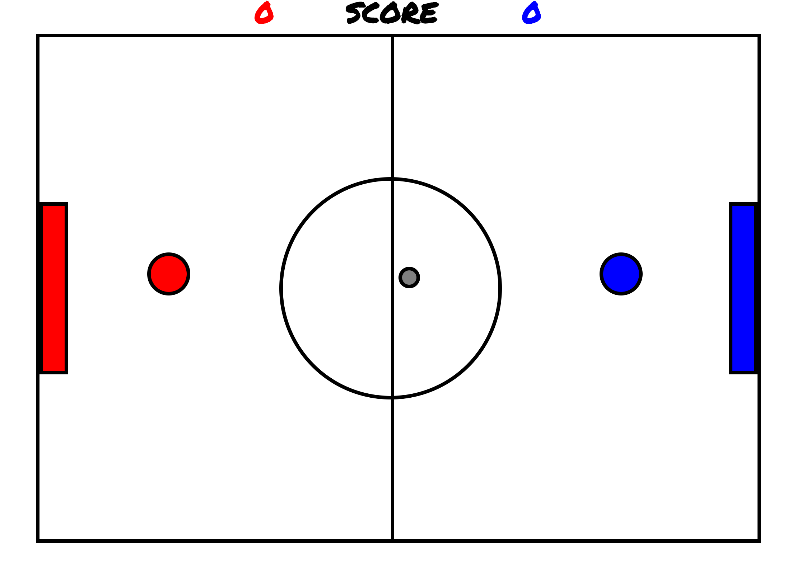

# [Rock-Soc]

## What is [Roc-Soc]?

> This is a soccer game that two players could fight with each other
and try to bounce the ball into the rival's goal. Try to win over
your rival by getting the most scores in the given time. The game 
should be fun and I chose this game because I'm always interested
in setting up with the object animations and transitions either on
the webpage or in the games.

## Technical Discussion

> HTML
> CSS
> Javascript/jQuery

### Notes on Game Structure

> This is the wrestling part, when red player touches the blue player carrying the ball.

     if ([73,76,75,74].includes(e.keyCode)&&!keys.includes(e.keyCode)){
      keys.push(e.keyCode);

     }else if(keys.includes(e.keyCode)&&$redBlueDist<=80&&$blueCenterDist<5){
      $blueGuy.parent().append($ball);
      $ball.offset({left:$blueLeft+50,top:$blueTop-50});

      if($redLeft<$blueLeft&&$redTop>=$blueTop-40&&$redTop<$blueTop+40){
        $blueGuy.addClass('ballBounceRight');
        setTimeout(function(){
          $blueGuy.removeClass('ballBounceRight');
          $blueGuy.offset({left:$blueLeft+600,top:$blueTop});
        },2000);
      }else if($redLeft>=$blueLeft&&$redTop>=$blueTop-40&&$redTop<$blueTop+40){
        $blueGuy.addClass('ballBounceLeft');
        setTimeout(function(){
          $blueGuy.removeClass('ballBounceLeft');
          $blueGuy.offset({left:$blueLeft-600,top:$blueTop});
        },2000);
      }else if($redTop<$blueTop&&$redLeft>$blueLeft-40&&$redLeft<$blueLeft+40){
        $blueGuy.addClass('ballBounceDown');
        setTimeout(function(){
          $blueGuy.removeClass('ballBounceDown');
          $blueGuy.offset({left:$blueLeft,top:$blueTop+600});
        },2000);
      }else if($redTop>=$blueTop&&$redLeft>=$blueLeft-40&&$redLeft<=$blueLeft+40){
        $blueGuy.addClass('ballBounceUp');
        setTimeout(function(){
          $blueGuy.removeClass('ballBounceUp');
          $blueGuy.offset({left:$blueLeft,top:$blueTop-600});
        },2000);
      }

     }else if(keys.includes(e.keyCode)){
      blueGuyBack();
     }

## The Making of [Rock-Soc]

> Thanks to the advice and example codes from Ramsey and J, the collision detection was successful.

## Opportunities for Future Growth

> I would add more smooth movements and find ways to let edges of the container bounce the players and the ball.
