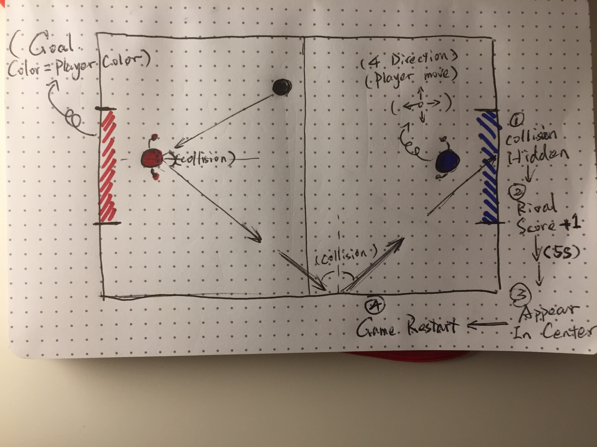
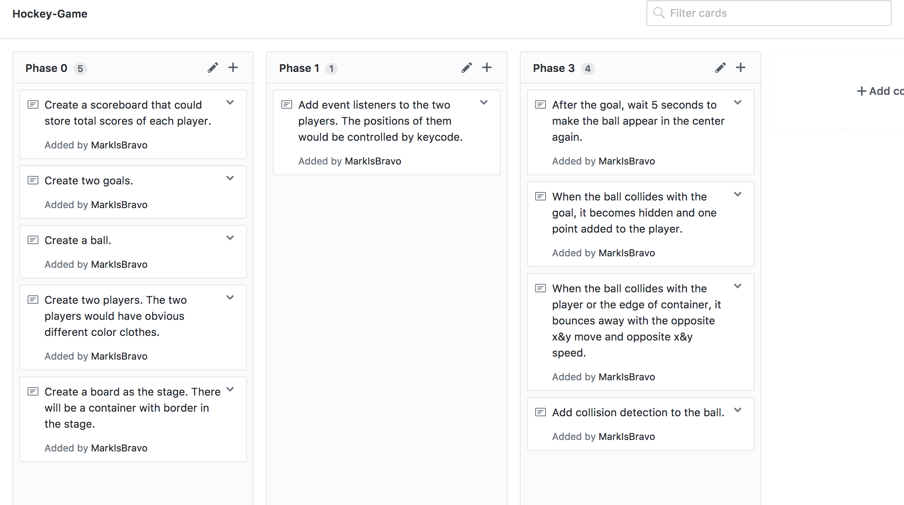

*** Mark Zheng Ma / 7/11/2017 ***

# [Rock-Soc] Proposal

## What is [Rock-Soc]?

Get your fingers ready for this intense game! Two players
could play together and use keyboards to move "themselves"
around the soccer field. The one who kicked the ball into 
the rival's goal gets one point. Let's see who would win 
this game!

## Wireframe

## Initial thoughts on game structure

* The collision detection of the ball would surely be a challenge:
  not only just to make the ball bounce, but also let the ball bounce
  towards the specific direction.
* I think it would be cool if I could make the player a facing direction
  for example, if the player faces the ball when collision, the ball
  would bounce fast and if the back it would bounce really slow.

## Phases of Completion

## Links and Resources

A link from Ramsey about collision detection(https://git.generalassemb.ly/gist/nasser/33b692b13894d2fab311b68866b5591d)
